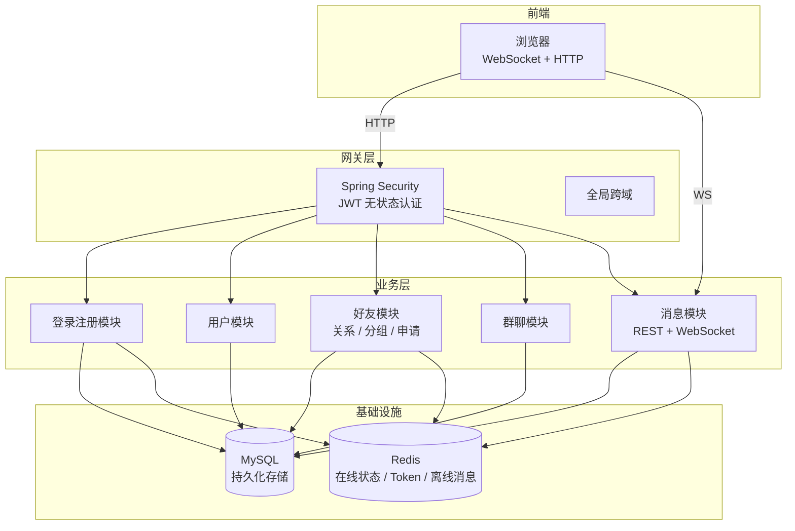
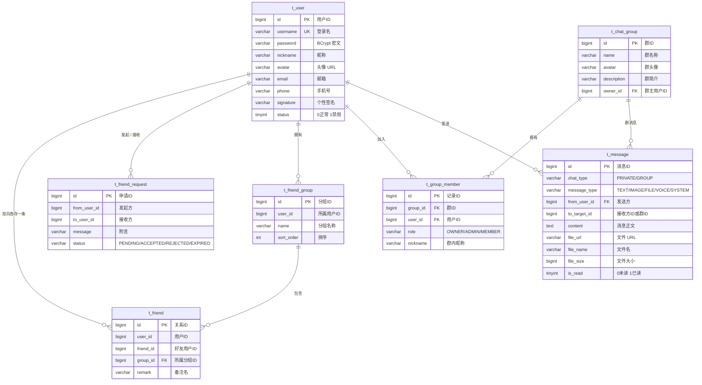

# 在线聊天系统

Spring Boot 4.0 + Java 21 大作业项目。

## 启动

使用 IntelliJ IDEA 配置好环境后启动。

- API 文档: <http://localhost:8080/api/swagger-ui.html>
- WebSocket: `ws://localhost:8080/api/ws/chat`

## 项目结构

```
common/        通用：统一返回体、异常、枚举、常量
config/        配置：Security、WebSocket、CORS、Redis、MyBatis、Swagger
security/      认证：JWT 签发校验、SecurityUser、登录拦截
module/
  auth/        登录注册
  user/        用户资料
  friend/      好友关系、好友分组、好友申请
  group/       群聊、群成员
  chat/        消息收发、历史记录、WebSocket 推送
```

## 技术栈

| 层   | 选型                                |
|-----|-----------------------------------|
| 框架  | Spring Boot 4.0.6                 |
| 安全  | Spring Security + JWT (jjwt 0.12) |
| ORM | MyBatis                           |
| 缓存  | Redis                             |
| 实时  | 原生 WebSocket                      |
| 文档  | SpringDoc OpenAPI                 |

## 系统架构



## 数据库 ER 图



### 关键设计说明

- **好友双向存储**: A 加 B 为好友，`t_friend` 插入 `(A,B)` 和 `(B,A)` 两条记录。好处是查"我的好友"只需 `WHERE user_id = ?`，不用反向 UNION。删好友时两条一起删。
- **分组归用户私有**: 每个用户管理自己的分组，注册时自动创建默认分组"我的好友"。
- **消息不分表**: 私聊和群聊共用 `t_message`，靠 `chat_type` + `to_target_id` 区分。核心查询索引为 `(chat_type, to_target_id, create_time DESC)`。
- **完整建表 SQL**: 见 `src/main/resources/sql/schema.sql`。

## API 约定

### 统一返回体

所有 HTTP 接口返回以下格式：

```json
{
  "code": 200,
  "message": "操作成功",
  "data": {}
}
```

- `code=200` 成功，其余见 `ResultCode` 枚举
- 401 → 未登录或 token 过期，前端需跳转登录页
- 接口文档：启动后访问 `/api/swagger-ui.html`

### 认证方式

```
Authorization: Bearer <jwt_token>
```

白名单路径（无需 token）：`/auth/**`、`/ws/**`、`/swagger-ui/**`

### WebSocket

连接时带 token 参数：

```
ws://localhost:8080/api/ws/chat?token=<jwt_token>
```

消息格式：

```json
{
  "type": "chat",
  "chatType": "PRIVATE",
  "toTargetId": 123,
  "messageType": "TEXT",
  "content": "hello"
}
```

## 模块分工

| 模块              | 要点                     |
|-----------------|------------------------|
| auth + security | JWT 签发/校验、登录注册、安全配置    |
| user + config   | 用户资料 CRUD、配置调优         |
| friend          | 好友关系 + 分组 + 申请，三层子功能   |
| group           | 群 CRUD + 成员管理 + 权限控制   |
| chat            | 消息持久化 + WebSocket 实时推送 |

各模块 README 在对应 `module/*/README.md`，含完整 TODO 清单。
